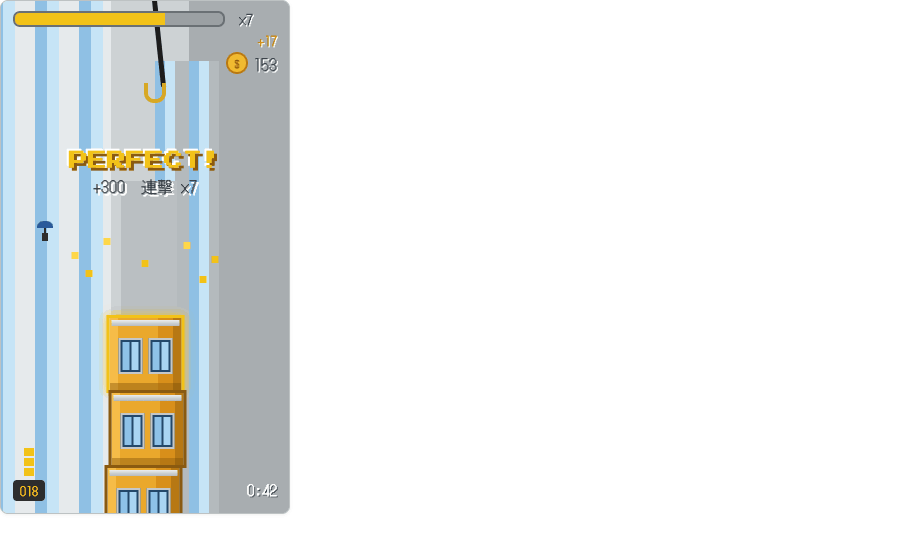

# 疊疊大樓 CITY BLOXX

像素風疊房子街機遊戲(類 Tower Bloxx)。畫面上方的吊車掛勾左右擺動,抓準時機放下方塊,把大樓一層一層疊上天際——對得越準分數越高,連續 Perfect 還有連擊加成;偏差太大方塊會滑落扣命,三條命用完就結束。

以 **HTML5 Canvas + 原生 JavaScript** 實作,單一 `index.html` 即可執行,無任何外部依賴(字型除外)。

### 🎮 [線上遊玩 → wen09210.github.io/tower-building](https://wen09210.github.io/tower-building/)



## 遊戲玩法

- **手機**:點擊畫面放下方塊
- **桌機**:按 `空白鍵` 放下方塊

| 判定 | 條件 | 結果 |
| --- | --- | --- |
| Perfect | 中心偏差 ≤ 5px | 自動對齊、星星特效、連擊 ×N 加成 |
| 一般疊放 | 有重疊但未對齊 | +100 分,整棟塔依偏差左右晃動 |
| 失誤 | 偏差超過方塊寬 50% | 方塊滑落出畫面,扣 1 命 |

- 每層 +100 分,連續 Perfect 依連擊數加成(+200、+300⋯)並獲得額外金幣
- 越疊越高,擺動角度與速度會逐漸增加
- 3 條命用完 → 遊戲結束,顯示最終得分/最高連擊/樓層高度/獲得金幣
- 彩蛋:連擊夠高時,會有小人撐傘從天而降

## 執行方式

直接用瀏覽器開啟 `index.html` 即可。若要在本機起伺服器:

```bash
python3 -m http.server 8931
# 瀏覽器開啟 http://localhost:8931/index.html
```

> 介面使用 Google Fonts 的像素字型(Cubic 11 / Press Start 2P),離線時會退回系統字型,不影響遊玩。

## 特色

- **像素風「日光工地」美術**:全程硬邊緣、無抗鋸齒,所有美術以 Canvas 幾何繪製,無圖片資源
- **長圖式天際線背景**:城市天際線以固定種子程序生成,與鏡頭 1:1 捲動——只有疊高時背景才往上捲,平時完全靜止;疊過所有大樓後只剩藍天與超高尖塔
- **物理與手感**:鐘擺式擺動(θ = maxAngle·sin(t·speed))、重力下落、以塔底為軸的阻尼簡諧塔身晃動
- **鏡頭系統**:塔高過半屏即平滑上移(lerp ease-out),視野外樓層停止繪製以節省效能
- **合成音效**:WebAudio 即時合成,無音檔,可於主選單開關
- **響應式**:手機直式 9:16 滿版與桌機橫式皆可遊玩

## 專案結構

| 檔案 | 說明 |
| --- | --- |
| `index.html` | 遊戲本體(Canvas 渲染 + 遊戲邏輯 + UI,單一檔案) |
| `DESIGN.md` | 設計交接文件(視覺 token、畫面規格、四階段開發需求) |
| `疊房子遊戲 設計稿.dc.html` / `support.js` | HTML 設計參考稿(僅供比對,非產品程式碼) |
| `screenshots/` | 設計稿各畫面截圖 |
| `uploads/` | 使用者提供的風格參考截圖 |

## 狀態管理(核心變數)

```
gameState        menu / playing / gameover
craneAngle       掛勾擺動角(鐘擺)
hangingBlock     吊掛中的方塊
fallingBlock     下落中的方塊 {x, y, vy}
tower            已疊樓層 [{x, y, w, h, perfect}]
swayAngle        塔身晃動(阻尼簡諧)
score / combo / coins / lives / floorCount / cameraY
```

詳細視覺規格與開發階段拆解見 [DESIGN.md](DESIGN.md)。
